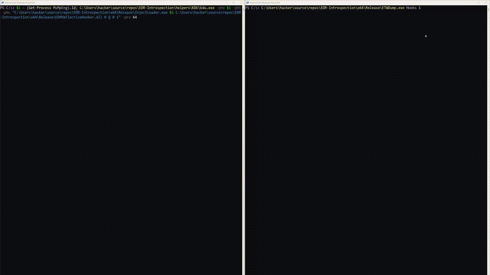

# InjectLoader

InjectLoader is a modular Windows process injection utility designed for security research and EDR introspection. 
It supports multiple DLL payload injection strategies (standard disk-based, host-mapped memory, reflective) combined with various remote execution techniques.
All techniques require **OpenProcess with PROCESS_ALL_ACCESS** (or almost all rights)

## DLL Loader Techniques

| DLL Loader Technique | Limitations                                                                       | Usage                                                                                                                                                                                                                                                               |
|----------------------|-----------------------------------------------------------------------------------|---------------------------------------------------------------------------------------------------------------------------------------------------------------------------------------------------------------------------------------------------------------------|
| LoadLibrary          | denied by CodeIntegrity (default for PPLs spawned by ELAM drivers)                | 1. write DLL path to remote proc<br>2. execute LoadLibrary(pRemotePath) in remote proc                                                                                                                                                                             |
| HostMapped + Loader  | cannot actually load DLLs in remote proc (bug)<br> denied by ACG (RW->RX)         | 1. write DLL to local proc<br>2. get local offsets for relocations and do relocs<br>3. write adjusted local image to remote proc<br>4. get address of setup functions<br>5. write DLL loader with the func offsets to the remote proc<br>6. execute the loader |
| Reflective Injection | DLL must implement and export a self-reflective loader<br> denied by ACG (RW->RX) | 1. write dll to remote proc<br>2. resolve and execute self-reflective loader                                                                                                                                                                                       |

## Execution Techniques

| Execution Technique | Limitations                                                                                 | Usage                                                                                                                                                                                                                                                                                                                                                                                                                                             |
|---------------------|---------------------------------------------------------------------------------------------|---------------------------------------------------------------------------------------------------------------------------------------------------------------------------------------------------------------------------------------------------------------------------------------------------------------------------------------------------------------------------------------------------------------------------------------------------|
| CreateRemoteThread  | can be denied by kernel callbacks (default in EDRs)                                         | CreateRemoteThread((LPTHREAD_START_ROUTINE)lpStartAddress)                                                                                                                                                                                                                                                                                                                                                                                        |
| Thread Hijacking    | denied by ACG(RW->RX) or CET (shadow stacks)<br>thread should be in a sleeping state        | 1. get a thread, suspend it and store the old RIP<br>2. define setup shellcode for clean prologue and epilogue<br>3. patch the setup shellcode with the old RIP (to continue at old context) and the remote routine (to be executed) with its args<br>4. write the patched shellcode to the remote process<br>5. set the RIP to the new setup shellcode and resume the thread<br>6. read back the memory to check if the execution was successful |
| QueueUserAPC2       | DLL must implement and export a self-reflective loader<br>thread should be running or ready | QueueUserAPC2((PAPCFUNC)lpStartAddress, hThread, (ULONG_PTR)lpParameter, (QUEUE_USER_APC_FLAGS)QUEUE_USER_APC_SPECIAL_USER_APC)                                                                                                                                                                                                                                                                                                                   |

## Usage
```
InjectLoader.exe (Get-Process cmd).id TestDLL.dll R H 1 1

# with kdu to hook any proc
kdu.exe -pho (Get-Process MsMpEng).Id -pht -phc "InjectLoader.exe $((Get-Process MsMpEng).Id) TestDLL.dll H Q 0 1" -prv 64
```

## Preview

